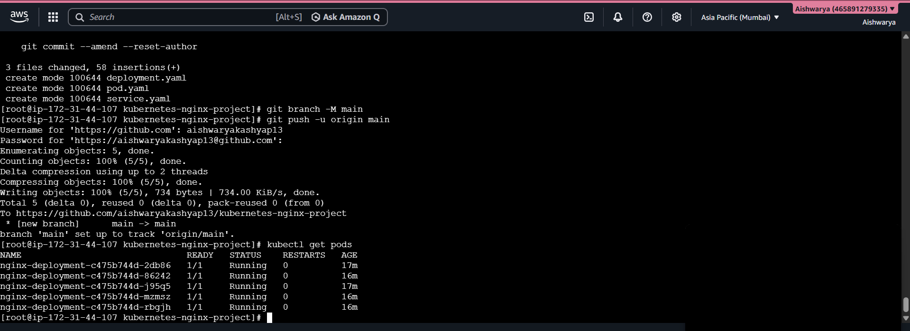
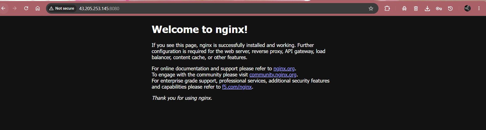

# 🚀 Kubernetes Nginx Deployment Project

This project demonstrates Kubernetes basics by deploying an Nginx application using Pods, Deployments, ReplicaSets, and Services.

---

# 📚 Concepts Covered

- Kubernetes Architecture
- Master Node
- Worker Node
- Pod
- ReplicaSet
- Deployment
- Service
- YAML Configuration
- Scaling Pods

---

# 🛠️ Tools Used

- Docker
- Kubernetes
- Minikube
- kubectl
- GitHub
- EC2 Linux

---

# 📂 Project Structure

```text
kubernetes-nginx-project/
│
├── pod.yaml
├── deployment.yaml
├── service.yaml
├── README.md
└── screenshots/
```

---

# 📄 YAML Files

## Pod YAML

```yaml
apiVersion: v1

kind: Pod

metadata:
  name: nginx-pod

spec:
  containers:
    - name: nginx-container
      image: nginx
      ports:
        - containerPort: 80
```

---

## Deployment YAML

```yaml
apiVersion: apps/v1

kind: Deployment

metadata:
  name: nginx-deployment

spec:
  replicas: 5

  selector:
    matchLabels:
      app: nginx

  template:

    metadata:
      labels:
        app: nginx

    spec:
      containers:
        - name: nginx-container
          image: nginx

          ports:
            - containerPort: 80
```

---

## Service YAML

```yaml
apiVersion: v1

kind: Service

metadata:
  name: nginx-service

spec:
  type: NodePort

  selector:
    app: nginx

  ports:
    - protocol: TCP
      port: 80
      targetPort: 80
      nodePort: 30007
```

---

# 🚀 Kubernetes Commands Used

## Create Pod

```bash
kubectl apply -f pod.yaml
```

## Create Deployment

```bash
kubectl apply -f deployment.yaml
```

## Create Service

```bash
kubectl apply -f service.yaml
```

## View Pods

```bash
kubectl get pods
```

## View Deployments

```bash
kubectl get deployments
```

## Scale Deployment

```bash
kubectl scale deployment nginx-deployment --replicas=5
```

---

# 📸 Project Screenshots

## Pods Running



---

## Deployment Running


---

## Nginx Webpage



---

## Pod YAML


---

## Deployment YAML


---

## Service YAML


---

# 🌐 Application Access

Application exposed using Kubernetes Service and accessed through EC2 public IP.

---

# 🎯 Learning Outcome

Successfully learned:

- Kubernetes architecture
- Pod creation
- Deployment management
- ReplicaSets
- Services
- Scaling applications
- YAML configuration
- Kubernetes networking basics

---

# 👩‍💻 Author

Aishwarya
